# Agenting Coach System Design

## Executive Summary

This document describes the architecture for a fully agenting AI coach that replaces the existing goal-setting coach with expanded capabilities including knowledge retrieval, web research, analytical reasoning, and long-term planning.

## Table of Contents

1. [Problem Statement](#problem-statement)
2. [Goals & Requirements](#goals--requirements)
3. [System Architecture](#system-architecture)
4. [Component Design](#component-design)
5. [Data Flow](#data-flow)
6. [Tool System](#tool-system)
7. [Database Schema](#database-schema)
8. [API Design](#api-design)
9. [UI/UX Design](#uiux-design)
10. [Decisions & Alternatives](#decisions--alternatives)
11. [Security Considerations](#security-considerations)
12. [Future Extensibility](#future-extensibility)

---

## Problem Statement

The current coaching system is limited to a linear, stage-based goal-setting flow. Users cannot:
- Ask analytical questions about their notes and goals
- Request the coach to research topics online
- Have the coach create and save long-term plans
- See the coach's reasoning process
- Engage in open-ended coaching conversations

## Goals & Requirements

### Functional Requirements

| ID | Requirement | Priority |
|----|-------------|----------|
| FR1 | Retrieve and analyze atomic notes from knowledge graph | Must |
| FR2 | Read goals with full context (title, why, notes, micro-wins) | Must |
| FR3 | Create long-term plans and save to goal notes | Must |
| FR4 | Require user confirmation before saving plans | Must |
| FR5 | Answer analytical questions using user data | Must |
| FR6 | Search the web for information | Must |
| FR7 | Fetch and analyze user-provided URLs | Must |
| FR8 | Search Wikipedia for factual information | Should |
| FR9 | Show visible reasoning steps in UI | Must |
| FR10 | Persist conversation sessions | Should |

### Non-Functional Requirements

| ID | Requirement | Target |
|----|-------------|--------|
| NFR1 | Response latency (no tools) | < 3 seconds |
| NFR2 | Response latency (with tools) | < 10 seconds |
| NFR3 | Maximum tool iterations | 10 per turn |
| NFR4 | Mobile responsive | Yes |
| NFR5 | Graceful error handling | All tool failures recoverable |

---

## System Architecture

### High-Level Architecture

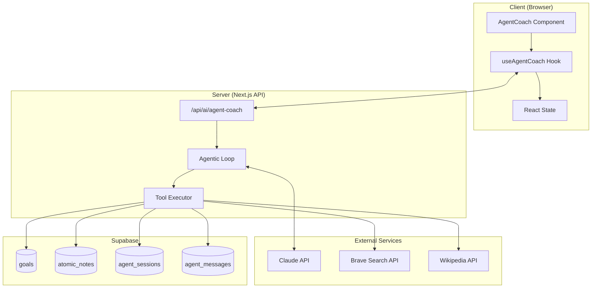
```mermaid
graph TB
    subgraph Client["Client (Browser)"]
        UI[AgentCoach Component]
        Hook[useAgentCoach Hook]
        State[React State]
    end

    subgraph Server["Server (Next.js API)"]
        API["/api/ai/agent-coach"]
        Loop[Agentic Loop]
        Executor[Tool Executor]
    end

    subgraph External["External Services"]
        Claude[Claude API]
        Brave[Brave Search API]
        Wiki[Wikipedia API]
    end

    subgraph Database["Supabase"]
        Goals[(goals)]
        Notes[(atomic_notes)]
        Sessions[(agent_sessions)]
        Messages[(agent_messages)]
    end

    UI --> Hook
    Hook --> State
    Hook <--> API
    API --> Loop
    Loop <--> Claude
    Loop --> Executor
    Executor --> Goals
    Executor --> Notes
    Executor --> Sessions
    Executor --> Messages
    Executor --> Brave
    Executor --> Wiki
```

### Request/Response Flow

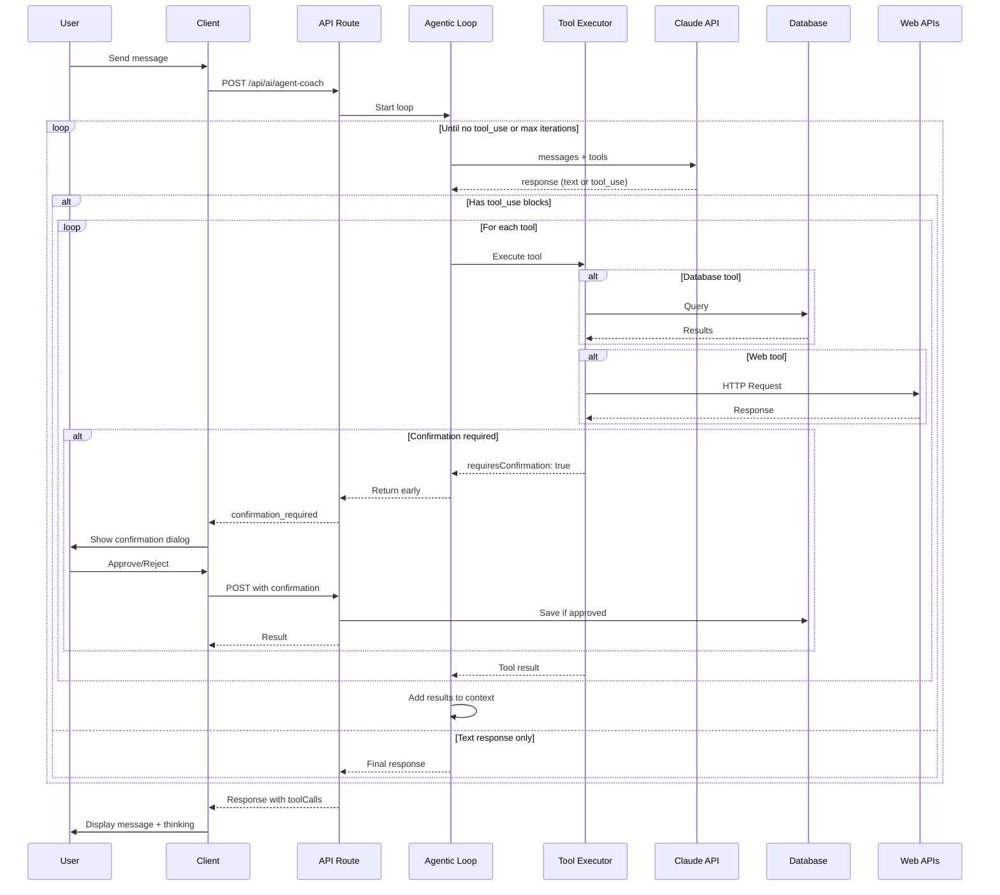
```mermaid
sequenceDiagram
    participant U as User
    participant C as Client
    participant A as API Route
    participant L as Agentic Loop
    participant T as Tool Executor
    participant AI as Claude API
    participant DB as Database
    participant Web as Web APIs

    U->>C: Send message
    C->>A: POST /api/ai/agent-coach
    A->>L: Start loop

    loop Until no tool_use or max iterations
        L->>AI: messages + tools
        AI-->>L: response (text or tool_use)

        alt Has tool_use blocks
            loop For each tool
                L->>T: Execute tool

                alt Database tool
                    T->>DB: Query
                    DB-->>T: Results
                end

                alt Web tool
                    T->>Web: HTTP Request
                    Web-->>T: Response
                end

                alt Confirmation required
                    T-->>L: requiresConfirmation: true
                    L-->>A: Return early
                    A-->>C: confirmation_required
                    C->>U: Show confirmation dialog
                    U->>C: Approve/Reject
                    C->>A: POST with confirmation
                    A->>DB: Save if approved
                    A-->>C: Result
                end

                T-->>L: Tool result
            end
            L->>L: Add results to context
        else Text response only
            L-->>A: Final response
        end
    end

    A-->>C: Response with toolCalls
    C->>U: Display message + thinking
```

---

## Component Design

### Client Components

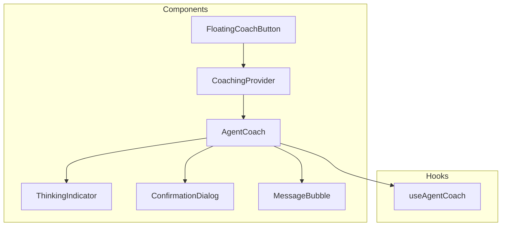
```mermaid
graph TB
    subgraph Components
        FAB[FloatingCoachButton]
        Provider[CoachingProvider]
        Agent[AgentCoach]
        Thinking[ThinkingIndicator]
        Confirm[ConfirmationDialog]
        Message[MessageBubble]
    end

    subgraph Hooks
        useAgent[useAgentCoach]
    end

    FAB --> Provider
    Provider --> Agent
    Agent --> Thinking
    Agent --> Confirm
    Agent --> Message
    Agent --> useAgent
```

#### Component Responsibilities

| Component | Responsibility |
|-----------|---------------|
| `FloatingCoachButton` | FAB entry point, opens coach panel |
| `CoachingProvider` | Context provider, manages open/close state |
| `AgentCoach` | Main chat interface, message list, input |
| `ThinkingIndicator` | Displays visible reasoning steps |
| `ConfirmationDialog` | Plan save approval UI |
| `MessageBubble` | Individual message rendering |
| `useAgentCoach` | State management, API communication |

### Server Components

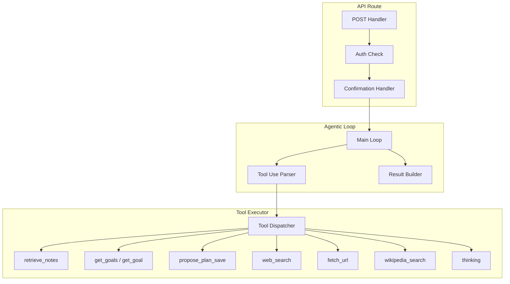
```mermaid
graph TB
    subgraph APIRoute["API Route"]
        Handler[POST Handler]
        Auth[Auth Check]
        ConfirmHandler[Confirmation Handler]
    end

    subgraph AgenticLoop["Agentic Loop"]
        Loop[Main Loop]
        ToolParser[Tool Use Parser]
        ResultBuilder[Result Builder]
    end

    subgraph ToolExecutor["Tool Executor"]
        Dispatch[Tool Dispatcher]
        NotesTool[retrieve_notes]
        GoalsTool[get_goals / get_goal]
        PlanTool[propose_plan_save]
        WebTool[web_search]
        URLTool[fetch_url]
        WikiTool[wikipedia_search]
        ThinkTool[thinking]
    end

    Handler --> Auth
    Auth --> ConfirmHandler
    ConfirmHandler --> Loop
    Loop --> ToolParser
    ToolParser --> Dispatch
    Dispatch --> NotesTool
    Dispatch --> GoalsTool
    Dispatch --> PlanTool
    Dispatch --> WebTool
    Dispatch --> URLTool
    Dispatch --> WikiTool
    Dispatch --> ThinkTool
    Loop --> ResultBuilder
```

---

## Data Flow

### Message State Flow

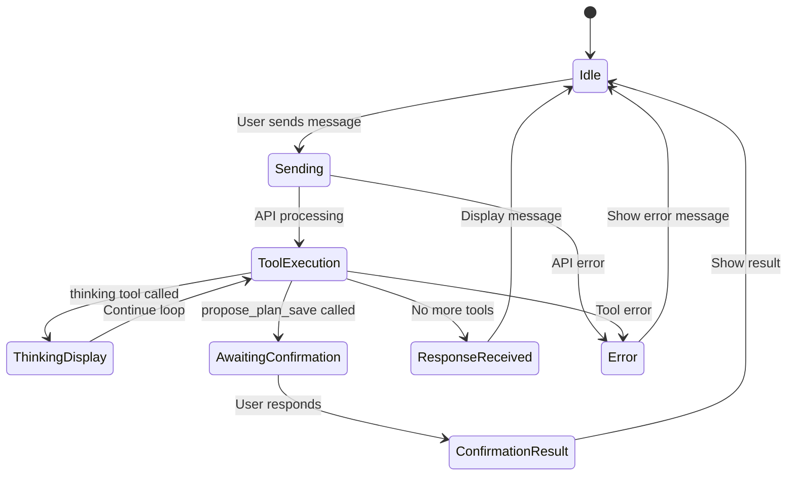
```mermaid
stateDiagram-v2
    [*] --> Idle

    Idle --> Sending: User sends message
    Sending --> ToolExecution: API processing
    ToolExecution --> ThinkingDisplay: thinking tool called
    ThinkingDisplay --> ToolExecution: Continue loop
    ToolExecution --> AwaitingConfirmation: propose_plan_save called
    AwaitingConfirmation --> ConfirmationResult: User responds
    ConfirmationResult --> Idle: Show result
    ToolExecution --> ResponseReceived: No more tools
    ResponseReceived --> Idle: Display message

    Sending --> Error: API error
    ToolExecution --> Error: Tool error
    Error --> Idle: Show error message
```

### Tool Execution State

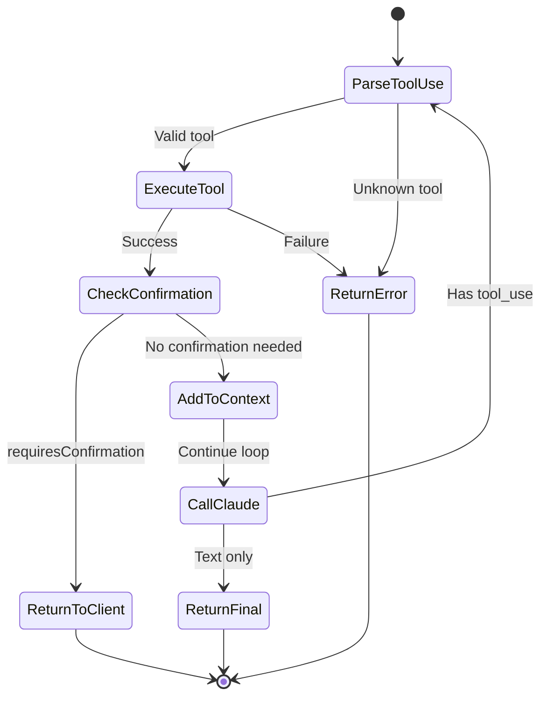
```mermaid
stateDiagram-v2
    [*] --> ParseToolUse

    ParseToolUse --> ExecuteTool: Valid tool
    ParseToolUse --> ReturnError: Unknown tool

    ExecuteTool --> CheckConfirmation: Success
    ExecuteTool --> ReturnError: Failure

    CheckConfirmation --> ReturnToClient: requiresConfirmation
    CheckConfirmation --> AddToContext: No confirmation needed

    AddToContext --> CallClaude: Continue loop
    CallClaude --> ParseToolUse: Has tool_use
    CallClaude --> ReturnFinal: Text only

    ReturnToClient --> [*]
    ReturnFinal --> [*]
    ReturnError --> [*]
```

---

## Tool System

### Tool Definitions

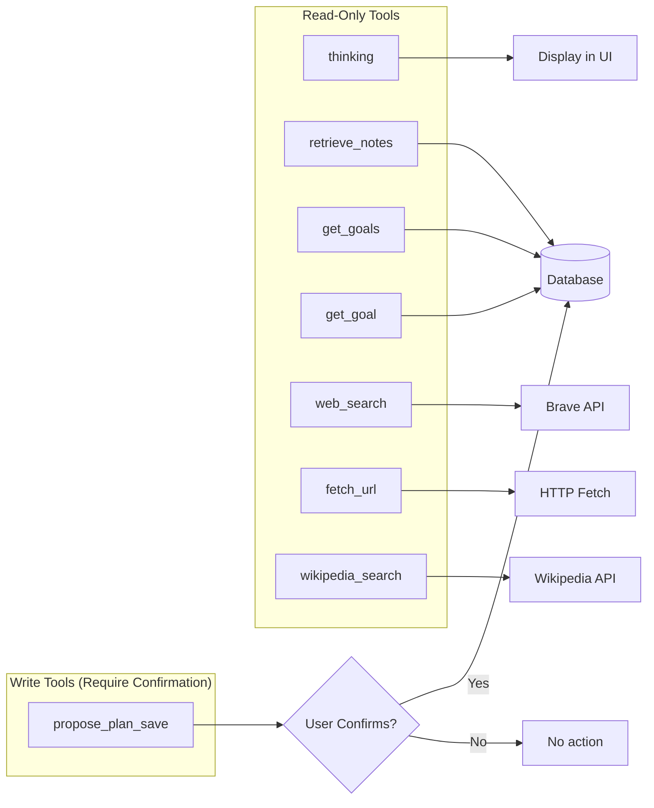
```mermaid
graph LR
    subgraph ReadOnly["Read-Only Tools"]
        T1[thinking]
        T2[retrieve_notes]
        T3[get_goals]
        T4[get_goal]
        T5[web_search]
        T6[fetch_url]
        T7[wikipedia_search]
    end

    subgraph WriteTools["Write Tools (Require Confirmation)"]
        T8[propose_plan_save]
    end

    T1 --> UI[Display in UI]
    T2 --> DB[(Database)]
    T3 --> DB
    T4 --> DB
    T5 --> Brave[Brave API]
    T6 --> Web[HTTP Fetch]
    T7 --> Wiki[Wikipedia API]
    T8 --> Confirm{User Confirms?}
    Confirm -->|Yes| DB
    Confirm -->|No| Cancel[No action]
```

### Tool Specifications

#### thinking
```typescript
{
  name: 'thinking',
  description: 'Share reasoning with user before taking action',
  input_schema: {
    type: 'object',
    properties: {
      thought: { type: 'string' }
    },
    required: ['thought']
  }
}
```
**Execution**: No-op on server, content passed to UI for display.

#### retrieve_notes
```typescript
{
  name: 'retrieve_notes',
  description: 'Search atomic notes in knowledge graph',
  input_schema: {
    type: 'object',
    properties: {
      query: { type: 'string' },
      limit: { type: 'number', default: 10 },
      note_type: {
        type: 'string',
        enum: ['permanent', 'literature', 'fleeting', 'all']
      }
    },
    required: ['query']
  }
}
```
**Execution**:
```sql
SELECT id, title, content, note_type, created_at,
       (SELECT array_agg(t.name) FROM note_tags nt
        JOIN tags t ON nt.tag_id = t.id
        WHERE nt.note_id = atomic_notes.id) as tags
FROM atomic_notes
WHERE user_id = $1
  AND (title ILIKE '%' || $2 || '%' OR content ILIKE '%' || $2 || '%')
LIMIT $3
```

#### get_goals
```typescript
{
  name: 'get_goals',
  description: 'Get all user goals with details',
  input_schema: {
    type: 'object',
    properties: {
      status_filter: {
        type: 'string',
        enum: ['active', 'parked', 'completed', 'all']
      }
    }
  }
}
```
**Execution**: Query `goals` with `micro_wins` join, filter by status.

#### get_goal
```typescript
{
  name: 'get_goal',
  description: 'Get single goal with full details',
  input_schema: {
    type: 'object',
    properties: {
      goal_id: { type: 'string' }
    },
    required: ['goal_id']
  }
}
```
**Execution**: Query single goal by ID with all micro-wins.

#### propose_plan_save
```typescript
{
  name: 'propose_plan_save',
  description: 'Propose saving a plan to goal notes (requires confirmation)',
  input_schema: {
    type: 'object',
    properties: {
      goal_id: { type: 'string' },
      plan_content: { type: 'string' },
      summary: { type: 'string' }
    },
    required: ['goal_id', 'plan_content', 'summary']
  }
}
```
**Execution**: Verify goal exists, return `requiresConfirmation: true` with plan preview.

#### web_search
```typescript
{
  name: 'web_search',
  description: 'Search the web for information',
  input_schema: {
    type: 'object',
    properties: {
      query: { type: 'string' },
      num_results: { type: 'number', default: 5, maximum: 10 }
    },
    required: ['query']
  }
}
```
**Execution**: Call Brave Search API, return title/url/description for each result.

#### fetch_url
```typescript
{
  name: 'fetch_url',
  description: 'Fetch and extract content from URL',
  input_schema: {
    type: 'object',
    properties: {
      url: { type: 'string' }
    },
    required: ['url']
  }
}
```
**Execution**: HTTP fetch, strip HTML tags, limit to 10,000 characters.

#### wikipedia_search
```typescript
{
  name: 'wikipedia_search',
  description: 'Search Wikipedia for factual information',
  input_schema: {
    type: 'object',
    properties: {
      query: { type: 'string' }
    },
    required: ['query']
  }
}
```
**Execution**: Call Wikipedia REST API `/page/summary/{title}`, fallback to search API.

---

## Database Schema

### Entity Relationship Diagram

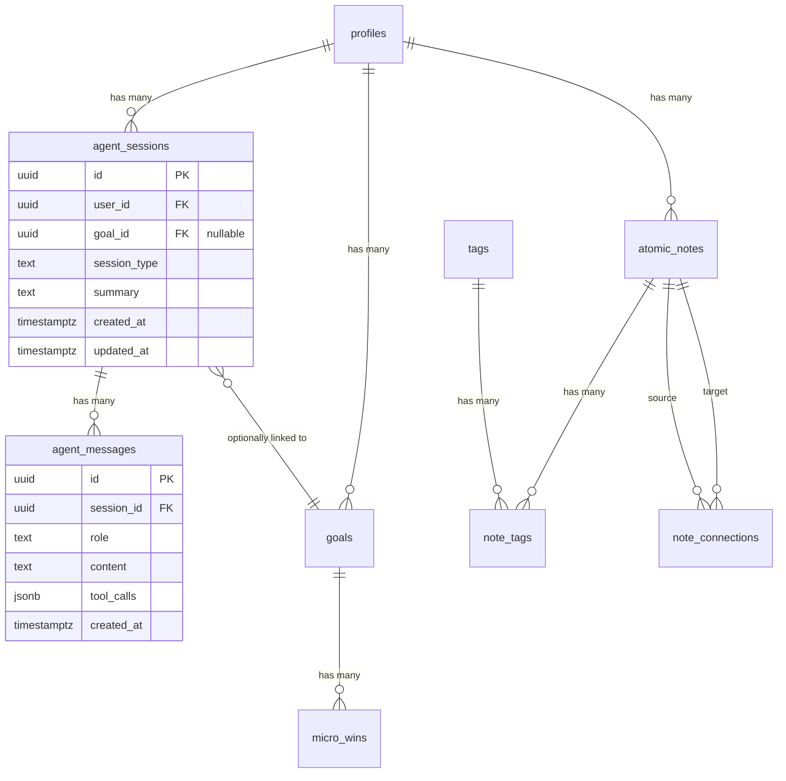
```mermaid
erDiagram
    profiles ||--o{ agent_sessions : "has many"
    profiles ||--o{ goals : "has many"
    profiles ||--o{ atomic_notes : "has many"

    agent_sessions ||--o{ agent_messages : "has many"
    agent_sessions }o--|| goals : "optionally linked to"

    goals ||--o{ micro_wins : "has many"

    atomic_notes ||--o{ note_tags : "has many"
    atomic_notes ||--o{ note_connections : "source"
    atomic_notes ||--o{ note_connections : "target"

    tags ||--o{ note_tags : "has many"

    agent_sessions {
        uuid id PK
        uuid user_id FK
        uuid goal_id FK "nullable"
        text session_type
        text summary
        timestamptz created_at
        timestamptz updated_at
    }

    agent_messages {
        uuid id PK
        uuid session_id FK
        text role
        text content
        jsonb tool_calls
        timestamptz created_at
    }
```

### New Tables

#### agent_sessions
```sql
CREATE TABLE public.agent_sessions (
    id UUID PRIMARY KEY DEFAULT uuid_generate_v4(),
    user_id UUID NOT NULL REFERENCES public.profiles(id) ON DELETE CASCADE,
    goal_id UUID REFERENCES public.goals(id) ON DELETE SET NULL,
    session_type TEXT NOT NULL DEFAULT 'general'
        CHECK (session_type IN ('general', 'planning', 'research', 'reflection')),
    summary TEXT,
    created_at TIMESTAMPTZ NOT NULL DEFAULT NOW(),
    updated_at TIMESTAMPTZ NOT NULL DEFAULT NOW()
);

CREATE INDEX agent_sessions_user_id_idx ON public.agent_sessions(user_id);
CREATE INDEX agent_sessions_goal_id_idx ON public.agent_sessions(goal_id);
```

#### agent_messages
```sql
CREATE TABLE public.agent_messages (
    id UUID PRIMARY KEY DEFAULT uuid_generate_v4(),
    session_id UUID NOT NULL REFERENCES public.agent_sessions(id) ON DELETE CASCADE,
    role TEXT NOT NULL CHECK (role IN ('user', 'assistant', 'tool_result')),
    content TEXT NOT NULL,
    tool_calls JSONB,  -- Array of {tool, input, result}
    created_at TIMESTAMPTZ NOT NULL DEFAULT NOW()
);

CREATE INDEX agent_messages_session_id_idx ON public.agent_messages(session_id);
```

### Row Level Security

```sql
-- agent_sessions policies
CREATE POLICY "Users can CRUD own agent sessions" ON public.agent_sessions
    FOR ALL USING (auth.uid() = user_id);

-- agent_messages policies
CREATE POLICY "Users can CRUD own agent messages" ON public.agent_messages
    FOR ALL USING (
        EXISTS (
            SELECT 1 FROM public.agent_sessions
            WHERE agent_sessions.id = agent_messages.session_id
            AND agent_sessions.user_id = auth.uid()
        )
    );
```

---

## API Design

### Endpoints

#### POST /api/ai/agent-coach

**Request Body (New Message)**
```typescript
interface AgentCoachRequest {
  messages: Array<{
    role: 'user' | 'assistant'
    content: string
  }>
  sessionId?: string
  goalContext?: {
    id: string
    title: string
  }
}
```

**Request Body (Confirmation Response)**
```typescript
interface ConfirmationRequest {
  messages: Array<{...}>
  pendingConfirmation: {
    approved: boolean
    goalId: string
    planContent: string
  }
}
```

**Response Types**

```typescript
// Normal message response
interface MessageResponse {
  type: 'message'
  message: string
  toolCalls: Array<{
    tool: string
    input: Record<string, unknown>
    result: unknown
  }>
  stopReason: string
}

// Confirmation required
interface ConfirmationResponse {
  type: 'confirmation_required'
  confirmationData: {
    type: 'plan_save'
    goalId: string
    goalTitle: string
    planContent: string
    summary: string
  }
  toolCalls: Array<{...}>
  partialMessages: Array<{...}>
}

// Confirmation result
interface ConfirmationResultResponse {
  type: 'confirmation_result'
  success: boolean
  message: string
}

// Error
interface ErrorResponse {
  type: 'error'
  error: string
}
```

### Response Flow Diagram

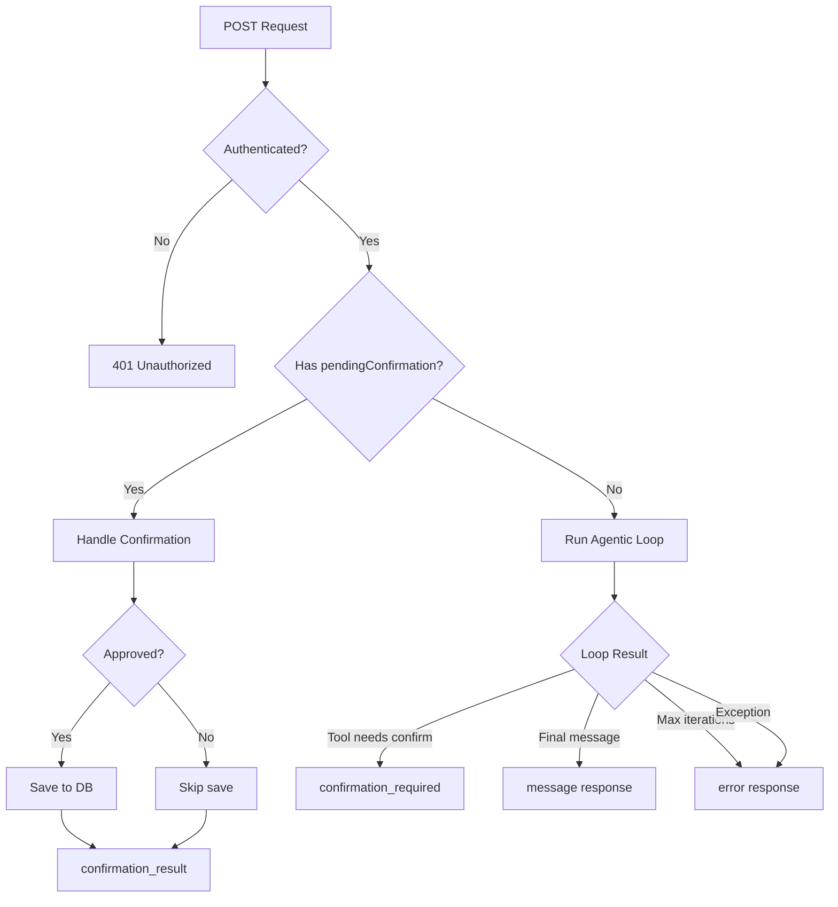
```mermaid
graph TD
    Request[POST Request] --> Auth{Authenticated?}
    Auth -->|No| E401[401 Unauthorized]
    Auth -->|Yes| CheckConfirm{Has pendingConfirmation?}

    CheckConfirm -->|Yes| HandleConfirm[Handle Confirmation]
    HandleConfirm --> Approved{Approved?}
    Approved -->|Yes| SavePlan[Save to DB]
    Approved -->|No| SkipSave[Skip save]
    SavePlan --> ConfirmResult[confirmation_result]
    SkipSave --> ConfirmResult

    CheckConfirm -->|No| AgentLoop[Run Agentic Loop]
    AgentLoop --> LoopResult{Loop Result}

    LoopResult -->|Tool needs confirm| ConfirmRequired[confirmation_required]
    LoopResult -->|Final message| MessageResp[message response]
    LoopResult -->|Max iterations| ErrorResp[error response]
    LoopResult -->|Exception| ErrorResp
```

---

## UI/UX Design

### Interaction States

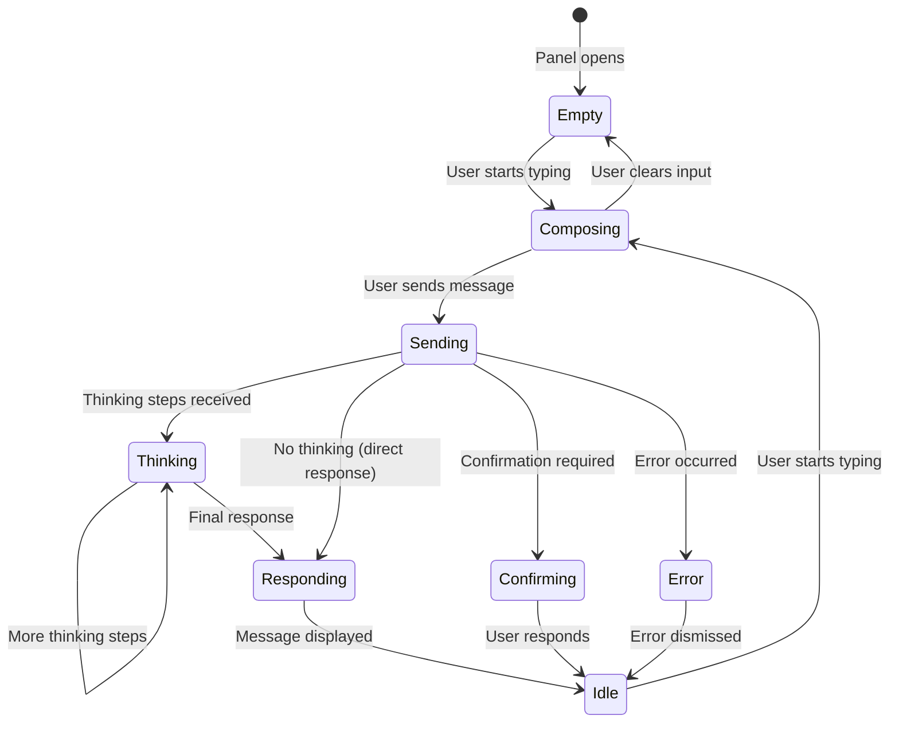
```mermaid
stateDiagram-v2
    [*] --> Empty: Panel opens

    Empty --> Composing: User starts typing
    Composing --> Empty: User clears input
    Composing --> Sending: User sends message

    Sending --> Thinking: Thinking steps received
    Thinking --> Thinking: More thinking steps
    Thinking --> Responding: Final response
    Sending --> Responding: No thinking (direct response)

    Responding --> Idle: Message displayed
    Idle --> Composing: User starts typing

    Sending --> Confirming: Confirmation required
    Confirming --> Idle: User responds

    Sending --> Error: Error occurred
    Error --> Idle: Error dismissed
```

### Visual Design Specifications

| Element | Style |
|---------|-------|
| Panel width | 100% mobile, max-w-lg desktop |
| Panel height | h-dvh (full viewport) |
| Header gradient | from-indigo-500 to-purple-600 |
| User messages | Right-aligned, bg-indigo-600, text-white |
| Assistant messages | Left-aligned, bg-gray-100, text-gray-900 |
| Thinking indicator | bg-indigo-50, italic text, spinning indicator |
| Confirmation dialog | bg-amber-50, border-amber-200 |
| Input | rounded-xl, border-2, focus:border-indigo-500 |

---

## Decisions & Alternatives

### Decision 1: Tool Execution Strategy

**Decision**: Execute tools server-side in API route

**Alternatives Considered**:

| Option | Pros | Cons |
|--------|------|------|
| **Server-side (chosen)** | Secure (no key exposure), single auth check, consistent execution | Longer request time, no streaming |
| Client-side tool execution | Could stream responses, faster perceived performance | Security risk (API keys exposed), complex auth |
| Edge function execution | Lower latency, scales well | Cold starts, limited runtime, harder debugging |

**Rationale**: Security is paramount. Database queries and API keys must not be exposed to the client. The additional latency is acceptable given the visible thinking steps provide feedback.

---

### Decision 2: Conversation Model

**Decision**: Single synchronous conversation (no background tasks)

**Alternatives Considered**:

| Option | Pros | Cons |
|--------|------|------|
| **Synchronous (chosen)** | Simpler UX, predictable behavior, easier error handling | Long waits for complex research |
| Background agents | Non-blocking, can do parallel research | Complex state management, notification system needed |
| Streaming with tool use | Faster perceived response | Claude tool_use requires full completion before execution |

**Rationale**: User explicitly requested single conversation flow. Background tasks add significant complexity and can confuse users about what the AI is doing.

---

### Decision 3: Confirmation Flow for Writes

**Decision**: Always require explicit confirmation for plan saves

**Alternatives Considered**:

| Option | Pros | Cons |
|--------|------|------|
| **Always confirm (chosen)** | User control, prevents mistakes, transparent | Extra click for every save |
| Auto-save with undo | Faster flow | Risky if user misses the action, undo complexity |
| User preference setting | Flexible | Settings UI needed, inconsistent behavior |

**Rationale**: User explicitly requested "always confirm". Writing to goal notes is a significant action that should require explicit approval.

---

### Decision 4: Tool Use vs Text Markers

**Decision**: Use Claude's native tool_use API

**Alternatives Considered**:

| Option | Pros | Cons |
|--------|------|------|
| **Native tool_use (chosen)** | Structured, reliable, type-safe, multi-tool support | Slightly more complex API integration |
| Text markers (current approach) | Simple prompt engineering | Regex parsing fragile, hard to validate, single action per turn |
| Function calling emulation | Works with any model | Inconsistent, prompt injection risk |

**Rationale**: Native tool_use is more reliable, supports multiple tools per turn, and provides structured input/output. The existing marker approach was designed for simpler single-stage transitions.

---

### Decision 5: Web Search Provider

**Decision**: Brave Search API

**Alternatives Considered**:

| Option | Pros | Cons |
|--------|------|------|
| **Brave Search (chosen)** | Privacy-focused, good pricing, simple API | Less comprehensive than Google |
| Google Custom Search | Most comprehensive results | Complex setup, expensive at scale |
| Bing Search API | Good results, Azure integration | Requires Azure account |
| SerpAPI | Unified API for multiple engines | Another dependency, pricing |
| No web search | Simpler | Major feature gap |

**Rationale**: Brave Search offers a good balance of privacy, simplicity, and cost. Can be swapped later if needed.

---

### Decision 6: Thinking Tool Approach

**Decision**: Dedicated `thinking` tool that passes content to UI

**Alternatives Considered**:

| Option | Pros | Cons |
|--------|------|------|
| **Thinking tool (chosen)** | Explicit, controllable, structured output | Extra tool call overhead |
| Parse assistant text for patterns | No extra calls | Fragile, mixes content and meta |
| Claude's extended thinking | Built-in reasoning | Not controllable, may be verbose |
| No visible thinking | Simpler | User can't see what AI is doing |

**Rationale**: A dedicated tool gives explicit control over what reasoning is shown. The system prompt instructs Claude to use it before taking actions.

---

### Decision 7: Session Persistence

**Decision**: Persist sessions to database (optional for MVP)

**Alternatives Considered**:

| Option | Pros | Cons |
|--------|------|------|
| **Database persistence (chosen)** | History viewable, can resume, analytics | Extra DB writes, migration needed |
| localStorage only | Simple, no backend changes | Lost on clear, no cross-device |
| No persistence | Simplest | No history, poor UX for long tasks |

**Rationale**: Database persistence enables session history and resumption. Marked as "should have" for MVP flexibility.

---

### Decision 8: Replace vs Extend Existing Coach

**Decision**: Replace existing GoalCoach entirely

**Alternatives Considered**:

| Option | Pros | Cons |
|--------|------|------|
| **Replace (chosen)** | Single coach UX, no confusion, cleaner codebase | Migration effort, lose specialized flow |
| Separate coach | Both available, gradual migration | Confusing UX, maintain two systems |
| Extend existing | Less code change | Architecture mismatch, complex state |

**Rationale**: User explicitly requested replacement. The agent coach can still help set goals while providing additional capabilities.

---

## Security Considerations

### Authentication & Authorization

- All API routes check `supabase.auth.getUser()` before processing
- RLS policies ensure users only access their own data
- Tool executor receives `userId` and includes it in all queries

### API Key Protection

- Anthropic, Brave, and other API keys stored in server environment only
- Keys never sent to client
- Keys not logged in error messages

### Input Validation

- Tool inputs validated against JSON schema before execution
- URL fetch limited to 10,000 characters to prevent memory issues
- Web search limited to 10 results maximum

### Content Security

- Fetched URLs have HTML stripped server-side
- No script execution from external content
- Plan content escaped before display in confirmation dialog

---

## Future Extensibility

### Potential Future Tools


```mermaid
graph LR
    subgraph Current["Current Tools"]
        T1[thinking]
        T2[retrieve_notes]
        T3[get_goals]
        T4[get_goal]
        T5[propose_plan_save]
        T6[web_search]
        T7[fetch_url]
        T8[wikipedia_search]
    end

    subgraph Future["Potential Future Tools"]
        F1[create_note]
        F2[create_goal]
        F3[update_micro_win]
        F4[schedule_reminder]
        F5[search_academic_papers]
        F6[generate_visualization]
        F7[export_to_document]
    end

    Current -.-> Future
```

### Extension Points

1. **New tools**: Add to `agent-coach-tools.ts` and `tool-executor.ts`
2. **New confirmation types**: Extend `confirmationData.type` union
3. **New session types**: Add to `session_type` enum in database
4. **New web APIs**: Add to executor with consistent error handling
5. **Streaming**: Could add streaming for text responses (not tool execution)

### Migration Path from Current Coach

1. Deploy agent coach alongside existing coach
2. Feature flag to switch between them
3. Migrate users gradually
4. Remove old coach code

---

## Infrastructure & Cost Analysis

### Proposed Hosting Stack

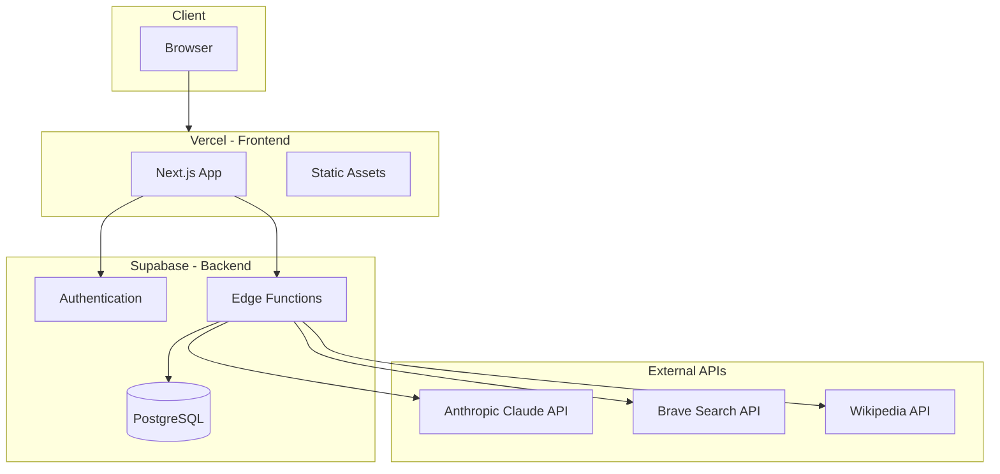
```mermaid
graph TB
    subgraph Client["Client"]
        Browser[Browser]
    end

    subgraph Vercel["Vercel - Frontend"]
        Next[Next.js App]
        Static[Static Assets]
    end

    subgraph Supabase["Supabase - Backend"]
        Auth[Authentication]
        DB[(PostgreSQL)]
        EdgeFn[Edge Functions]
    end

    subgraph External["External APIs"]
        Claude[Anthropic Claude API]
        Brave[Brave Search API]
        Wiki[Wikipedia API]
    end

    Browser --> Vercel
    Next --> Auth
    Next --> EdgeFn
    EdgeFn --> DB
    EdgeFn --> Claude
    EdgeFn --> Brave
    EdgeFn --> Wiki
```

#### Recommended Stack

| Layer | Service | Rationale |
|-------|---------|-----------|
| **Frontend** | Vercel | Already using, excellent Next.js support |
| **Agent Loop** | Supabase Edge Functions | 150s timeout (vs Vercel's 60s), closer to DB, included in plan |
| **Database** | Supabase PostgreSQL | Already using, RLS built-in |
| **Auth** | Supabase Auth | Already using |
| **LLM** | Anthropic Claude API | Best reasoning, native tool_use |
| **Web Search** | Brave Search API | Privacy-focused, good free tier |
| **Caching (later)** | Upstash Redis | Serverless, Vercel/Supabase compatible |

#### Why Supabase Edge Functions for Agent Loop?

The agent coach requires longer execution times due to multi-turn tool loops. Comparing options:

| Platform | Max Timeout | Cold Start | DB Proximity | Cost |
|----------|-------------|------------|--------------|------|
| Vercel API Routes | 60s (Pro: 300s) | ~200ms | Remote | Included |
| **Supabase Edge Functions** | 150s | ~50ms | Local | Included |
| Railway/Fly.io | Unlimited | None | Remote | $5-20/mo |
| AWS Lambda | 900s | ~500ms | Remote | ~$0.20/1M |

**Supabase Edge Functions wins** because:
1. 150s timeout handles complex multi-tool chains
2. Same-region as database = faster queries
3. Already paying for Supabase
4. Deno runtime is secure and fast

#### Architecture with Supabase Edge Functions

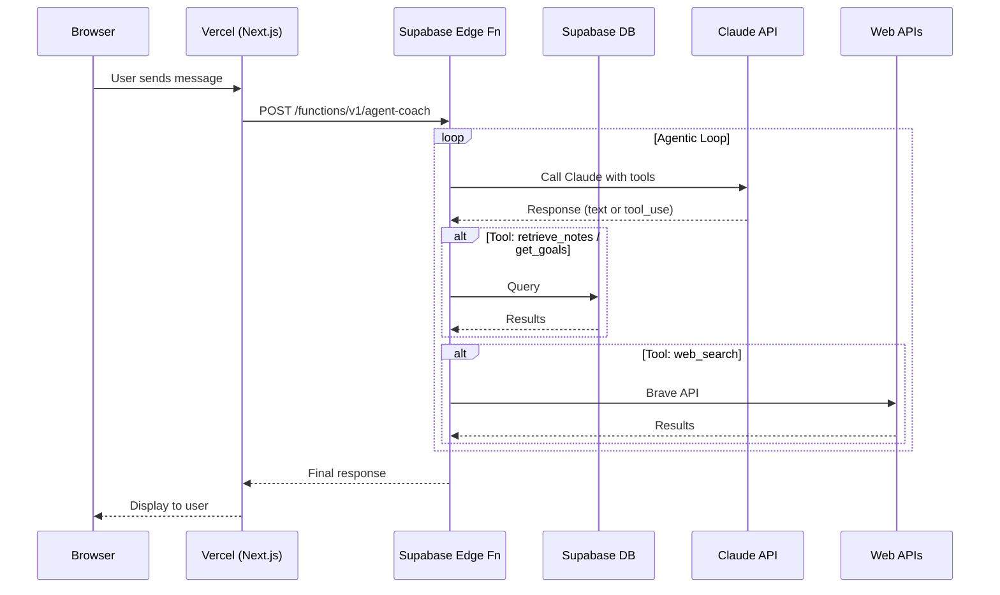
```mermaid
sequenceDiagram
    participant B as Browser
    participant V as Vercel (Next.js)
    participant S as Supabase Edge Fn
    participant DB as Supabase DB
    participant C as Claude API
    participant W as Web APIs

    B->>V: User sends message
    V->>S: POST /functions/v1/agent-coach

    loop Agentic Loop
        S->>C: Call Claude with tools
        C-->>S: Response (text or tool_use)

        alt Tool: retrieve_notes / get_goals
            S->>DB: Query
            DB-->>S: Results
        end

        alt Tool: web_search
            S->>W: Brave API
            W-->>S: Results
        end
    end

    S-->>V: Final response
    V-->>B: Display to user
```

#### File Changes for Edge Function Approach

Instead of `/src/app/api/ai/agent-coach/route.ts`, we create:

| File | Purpose |
|------|---------|
| `supabase/functions/agent-coach/index.ts` | Main edge function (Deno) |
| `src/app/api/ai/agent-coach/route.ts` | Thin proxy to edge function |

The proxy pattern keeps the client simple while leveraging edge function benefits.

### Portability: Moving the Agent Loop

The agent loop is designed to be **runtime-agnostic**. It's a pure function that:
1. Takes: messages, user context, tool definitions
2. Does: loop calling Claude API + executing tools
3. Returns: response with tool call history

#### What's Portable

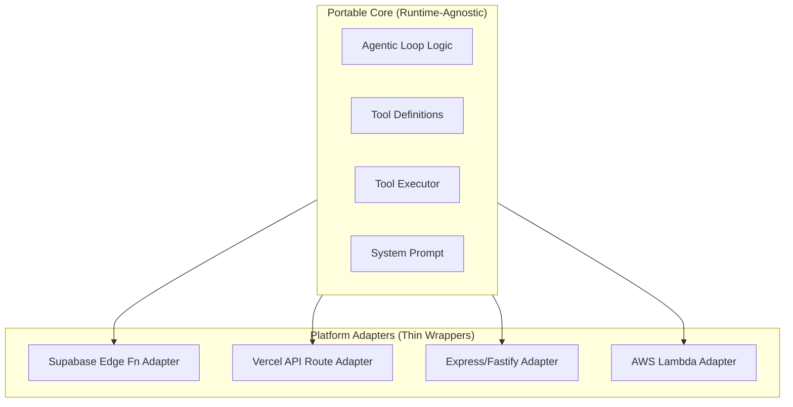
```mermaid
graph TB
    subgraph Portable["Portable Core (Runtime-Agnostic)"]
        Loop[Agentic Loop Logic]
        Tools[Tool Definitions]
        Executor[Tool Executor]
        Prompt[System Prompt]
    end

    subgraph Adapters["Platform Adapters (Thin Wrappers)"]
        A1[Supabase Edge Fn Adapter]
        A2[Vercel API Route Adapter]
        A3[Express/Fastify Adapter]
        A4[AWS Lambda Adapter]
    end

    Portable --> A1
    Portable --> A2
    Portable --> A3
    Portable --> A4
```

#### Code Structure for Portability

```
src/lib/ai/agent-coach/
├── core.ts              # Pure agentic loop (no platform deps)
├── tools.ts             # Tool definitions (JSON schemas)
├── executor.ts          # Tool execution (takes DB client as param)
├── prompt.ts            # System prompt
└── types.ts             # TypeScript interfaces

supabase/functions/agent-coach/
└── index.ts             # Thin adapter: HTTP → core → HTTP

src/app/api/ai/agent-coach/
└── route.ts             # Alternative: Vercel adapter
```

#### Core Loop Signature (Platform-Agnostic)

```typescript
// src/lib/ai/agent-coach/core.ts

interface AgentLoopParams {
  messages: Message[]
  userId: string
  dbClient: SupabaseClient  // Injected, not imported
  anthropicKey: string      // Injected, not from env
  braveKey?: string
}

interface AgentLoopResult {
  type: 'message' | 'confirmation_required' | 'error'
  message?: string
  toolCalls?: ToolCall[]
  confirmationData?: ConfirmationData
}

export async function runAgentLoop(params: AgentLoopParams): Promise<AgentLoopResult> {
  // Pure logic - no platform-specific imports
  // All dependencies injected via params
}
```

#### Migration Effort by Target

| From → To | Effort | Changes Required |
|-----------|--------|------------------|
| Supabase Edge → Vercel API | **15 min** | New adapter file, update proxy route |
| Supabase Edge → Express | **30 min** | New adapter, add express server |
| Supabase Edge → AWS Lambda | **1 hour** | New adapter, SAM/Serverless config |
| Supabase Edge → Cloudflare Workers | **1 hour** | New adapter, wrangler config |
| Any → Self-hosted (Railway/Fly) | **2 hours** | Dockerfile, new adapter |

#### Example: Vercel API Route Adapter

```typescript
// src/app/api/ai/agent-coach/route.ts
import { runAgentLoop } from '@/lib/ai/agent-coach/core'
import { createClient } from '@/lib/supabase/server'

export async function POST(request: Request) {
  const supabase = await createClient()
  const { data: { user } } = await supabase.auth.getUser()

  if (!user) {
    return Response.json({ error: 'Unauthorized' }, { status: 401 })
  }

  const body = await request.json()

  // Call portable core with injected dependencies
  const result = await runAgentLoop({
    messages: body.messages,
    userId: user.id,
    dbClient: supabase,
    anthropicKey: process.env.ANTHROPIC_API_KEY!,
    braveKey: process.env.BRAVE_SEARCH_API_KEY
  })

  return Response.json(result)
}
```

#### Example: Supabase Edge Function Adapter

```typescript
// supabase/functions/agent-coach/index.ts
import { serve } from 'https://deno.land/std@0.168.0/http/server.ts'
import { createClient } from 'https://esm.sh/@supabase/supabase-js@2'
import { runAgentLoop } from './core.ts'  // Bundled copy

serve(async (req) => {
  const authHeader = req.headers.get('Authorization')!
  const supabase = createClient(
    Deno.env.get('SUPABASE_URL')!,
    Deno.env.get('SUPABASE_ANON_KEY')!,
    { global: { headers: { Authorization: authHeader } } }
  )

  const { data: { user } } = await supabase.auth.getUser()
  if (!user) {
    return new Response(JSON.stringify({ error: 'Unauthorized' }), { status: 401 })
  }

  const body = await req.json()

  const result = await runAgentLoop({
    messages: body.messages,
    userId: user.id,
    dbClient: supabase,
    anthropicKey: Deno.env.get('ANTHROPIC_API_KEY')!,
    braveKey: Deno.env.get('BRAVE_SEARCH_API_KEY')
  })

  return new Response(JSON.stringify(result), {
    headers: { 'Content-Type': 'application/json' }
  })
})
```

#### Why This Matters

1. **No vendor lock-in** - Can move to any platform as needs change
2. **Easy testing** - Core logic testable without mocking platform APIs
3. **Incremental migration** - Can run on multiple platforms during transition
4. **Local development** - Run core directly in tests without edge function emulator

### Current vs Proposed Comparison

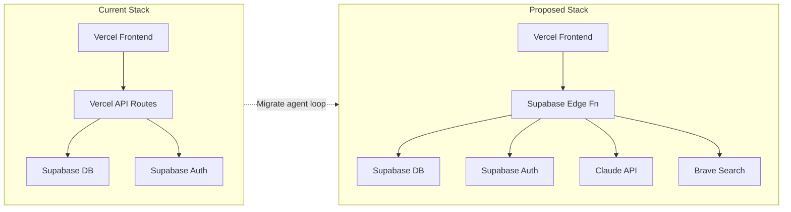
```mermaid
graph LR
    subgraph Current["Current Stack"]
        C1[Vercel Frontend]
        C2[Vercel API Routes]
        C3[Supabase DB]
        C4[Supabase Auth]
        C1 --> C2
        C2 --> C3
        C2 --> C4
    end

    subgraph Proposed["Proposed Stack"]
        P1[Vercel Frontend]
        P2[Supabase Edge Fn]
        P3[Supabase DB]
        P4[Supabase Auth]
        P5[Claude API]
        P6[Brave Search]
        P1 --> P2
        P2 --> P3
        P2 --> P4
        P2 --> P5
        P2 --> P6
    end

    Current -.->|Migrate agent loop| Proposed
```

### Hosting Cost Summary

| Service | Tier | Monthly Cost | What You Get |
|---------|------|--------------|--------------|
| **Vercel** | Hobby/Pro | $0-20 | Frontend hosting, static assets |
| **Supabase** | Pro | $25 | DB, Auth, Edge Functions (included) |
| **Anthropic** | Pay-as-you-go | $80-8,000+ | Claude API (usage-based) |
| **Brave Search** | Free/Basic | $0-9 | Web search API |
| **Upstash** (later) | Pay-as-you-go | $0-10 | Redis caching |

**Total Infrastructure: $25-55/month + Claude usage**

### Cost Breakdown by Service

#### Anthropic Claude API

| Model | Input Cost | Output Cost | Typical Request | Cost/Request |
|-------|------------|-------------|-----------------|--------------|
| Claude Sonnet 4 | $3/1M tokens | $15/1M tokens | 2K in, 500 out | ~$0.0135 |

**Agent Coach Cost Factors:**
- Multi-turn tool loops multiply costs (avg 2-4 Claude calls per user message)
- Tool results add to context (notes, goals, web results)
- Estimated **$0.03 - $0.08 per user interaction** with tools

**Monthly Projections:**

| Users | Interactions/User/Day | Monthly Interactions | Est. Monthly Cost |
|-------|----------------------|---------------------|-------------------|
| 10 | 5 | 1,500 | $45 - $120 |
| 100 | 5 | 15,000 | $450 - $1,200 |
| 1,000 | 5 | 150,000 | $4,500 - $12,000 |

#### Brave Search API

| Plan | Requests/Month | Cost | Cost/Request |
|------|---------------|------|--------------|
| Free | 2,000 | $0 | $0 |
| Basic | 20,000 | $9/mo | $0.00045 |
| Pro | 100,000 | $49/mo | $0.00049 |

**Projection**: At 100 users, ~5,000 searches/month = Basic plan ($9/mo)

#### Wikipedia API

- **Cost**: Free (public API)
- **Rate Limit**: Reasonable use, no hard limit for authenticated requests
- **Consideration**: Add User-Agent header per Wikipedia guidelines

#### Supabase

| Tier | Cost | Includes |
|------|------|----------|
| Free | $0 | 500MB DB, 50K auth users, 1GB bandwidth |
| Pro | $25/mo | 8GB DB, unlimited auth, 250GB bandwidth |

**Agent Session Impact:**
- Each session: ~1-5KB (messages + tool_calls JSON)
- 100 users × 5 sessions/day × 30 days = 15,000 sessions/month
- Storage: ~75MB/month additional
- **Verdict**: Minimal impact on existing Supabase costs

#### Vercel

| Tier | Cost | Includes |
|------|------|----------|
| Hobby | $0 | 100GB bandwidth, 100 hrs serverless |
| Pro | $20/mo | 1TB bandwidth, 1000 hrs serverless |

**Agent Coach Impact:**
- Longer API route execution times (tool loops)
- More serverless function invocations
- **Consideration**: May push toward Pro tier faster

### Total Cost Projection

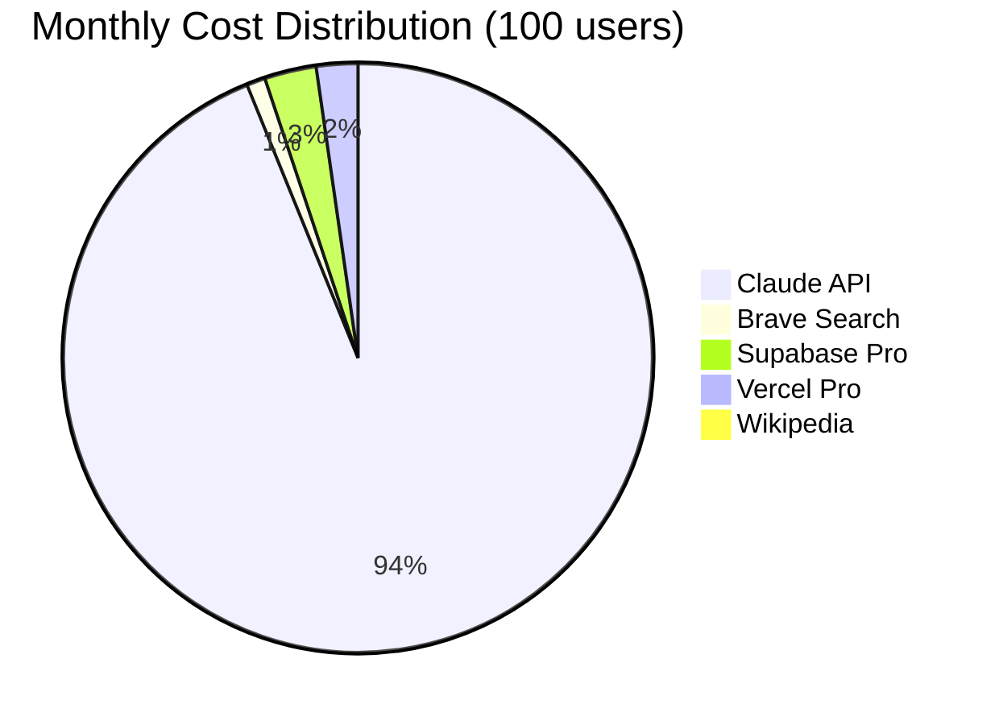
```mermaid
pie title Monthly Cost Distribution (100 users)
    "Claude API" : 825
    "Brave Search" : 9
    "Supabase Pro" : 25
    "Vercel Pro" : 20
    "Wikipedia" : 0
```

| Scale | Claude | Brave | Supabase | Vercel | Total |
|-------|--------|-------|----------|--------|-------|
| 10 users | $80 | $0 | $0 | $0 | **$80** |
| 100 users | $825 | $9 | $25 | $20 | **$879** |
| 1,000 users | $8,250 | $49 | $25 | $20 | **$8,344** |

### Cost Optimization Strategies

#### 1. Prompt Caching (Claude)

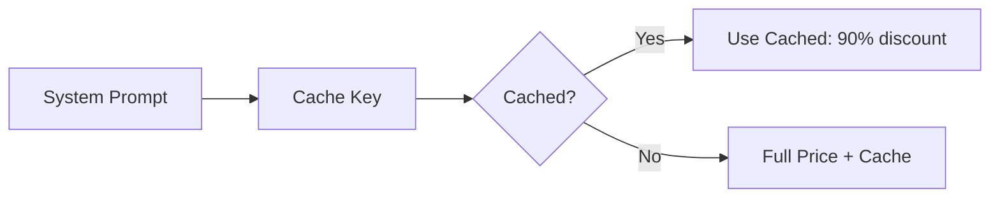
```mermaid
graph LR
    A[System Prompt] --> B[Cache Key]
    B --> C{Cached?}
    C -->|Yes| D[Use Cached: 90% discount]
    C -->|No| E[Full Price + Cache]
```

- Anthropic offers prompt caching for system prompts
- System prompt (~1K tokens) cached = $0.30/1M instead of $3/1M
- **Savings**: ~10% on input costs

#### 2. Context Truncation

| Strategy | Implementation | Savings |
|----------|---------------|---------|
| Limit conversation history | Keep last 10 messages | 30-50% input tokens |
| Summarize old messages | AI-generated summary | 40-60% input tokens |
| Limit tool results | Top 5 notes, 3 search results | 20-30% input tokens |

#### 3. Tool Result Caching

```typescript
// Cache web search results for 1 hour
const cacheKey = `search:${query}`
const cached = await redis.get(cacheKey)
if (cached) return JSON.parse(cached)

const results = await braveSearch(query)
await redis.setex(cacheKey, 3600, JSON.stringify(results))
return results
```

- Add Redis/Upstash for caching (~$10/mo)
- Cache web searches, Wikipedia results
- **Savings**: 50%+ reduction in external API calls

#### 4. Model Tiering

| Task | Model | Cost |
|------|-------|------|
| Simple queries (no tools) | Claude Haiku | $0.25/$1.25 per 1M |
| Complex analysis | Claude Sonnet | $3/$15 per 1M |
| Deep research | Claude Opus | $15/$75 per 1M |

- Route simple questions to Haiku (90% cheaper)
- Use Sonnet for tool-using interactions
- **Implementation**: Classify query complexity before routing

#### 5. Rate Limiting

```typescript
// Per-user rate limiting
const DAILY_LIMIT = 50 // interactions per user per day
const usage = await getUserDailyUsage(userId)
if (usage >= DAILY_LIMIT) {
  return { error: 'Daily limit reached', resetAt: getNextMidnight() }
}
```

- Prevents runaway costs from power users
- Encourages thoughtful interactions

### Infrastructure Decisions

#### Decision: Where to Run Agent Loop

| Option | Pros | Cons | Cost Impact |
|--------|------|------|-------------|
| **Vercel API Routes (chosen)** | Simple, existing infra | 60s timeout, cold starts | Included in Vercel plan |
| Supabase Edge Functions | 150s timeout, closer to DB | Deno runtime, separate deploy | Included in Supabase |
| Dedicated server (Railway/Fly) | No timeout, full control | Extra infra to manage | $5-20/mo |
| AWS Lambda | Scalable, cheap | Complex setup, cold starts | ~$0.20/1M requests |

**Rationale**: Start with Vercel API routes for simplicity. If timeouts become an issue (complex multi-tool chains), migrate to Supabase Edge Functions or dedicated server.

#### Decision: Caching Layer

| Option | Pros | Cons | Cost |
|--------|------|------|------|
| **No cache (MVP)** | Simple | Higher API costs | $0 |
| Upstash Redis | Serverless, Vercel integration | Another service | $10/mo |
| Supabase as cache | Already have it | Not designed for it | $0 |

**Rationale**: Skip caching for MVP. Add Upstash when costs become significant (>100 users).

#### Decision: Search API Provider

| Provider | Free Tier | Paid | Quality | Privacy |
|----------|-----------|------|---------|---------|
| **Brave (chosen)** | 2K/mo | $9/mo for 20K | Good | Best |
| Google CSE | 100/day | $5/1K queries | Best | Poor |
| Bing | 1K/mo | $7/1K queries | Good | Medium |
| DuckDuckGo | None (unofficial) | N/A | Medium | Best |

**Rationale**: Brave offers best privacy-to-cost ratio. Free tier sufficient for initial testing.

### Monitoring & Alerts

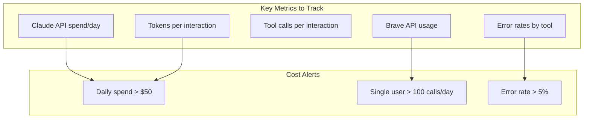
```mermaid
graph TB
    subgraph Metrics["Key Metrics to Track"]
        M1[Claude API spend/day]
        M2[Tokens per interaction]
        M3[Tool calls per interaction]
        M4[Brave API usage]
        M5[Error rates by tool]
    end

    subgraph Alerts["Cost Alerts"]
        A1[Daily spend > $50]
        A2[Single user > 100 calls/day]
        A3[Error rate > 5%]
    end

    M1 --> A1
    M2 --> A1
    M4 --> A2
    M5 --> A3
```

**Implementation:**
1. Log all Claude API calls with token counts
2. Track per-user usage in database
3. Set up Anthropic usage alerts in dashboard
4. Weekly cost review during growth phase

### Cost-Conscious Architecture

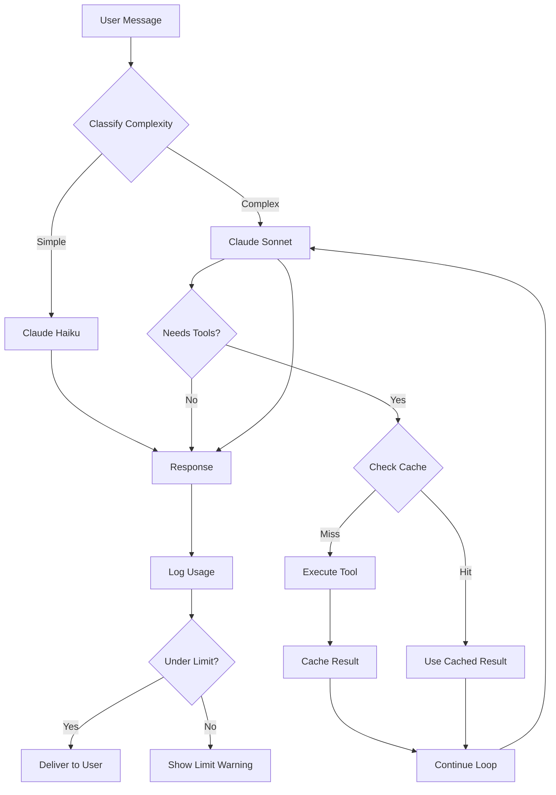
```mermaid
graph TD
    User[User Message] --> Classify{Classify Complexity}

    Classify -->|Simple| Haiku[Claude Haiku]
    Classify -->|Complex| Sonnet[Claude Sonnet]

    Haiku --> Response
    Sonnet --> Tools{Needs Tools?}

    Tools -->|No| Response
    Tools -->|Yes| Cache{Check Cache}

    Cache -->|Hit| UseCached[Use Cached Result]
    Cache -->|Miss| Execute[Execute Tool]

    Execute --> Store[Cache Result]
    Store --> Continue[Continue Loop]
    UseCached --> Continue

    Continue --> Sonnet
    Sonnet --> Response

    Response --> Log[Log Usage]
    Log --> RateCheck{Under Limit?}
    RateCheck -->|Yes| Deliver[Deliver to User]
    RateCheck -->|No| Throttle[Show Limit Warning]
```

### Scaling Roadmap

| Phase | Users | Monthly Cost | Optimizations |
|-------|-------|--------------|---------------|
| MVP | 1-10 | ~$80 | None needed |
| Early | 10-100 | ~$900 | Add rate limiting |
| Growth | 100-500 | ~$4,500 | Add caching, model tiering |
| Scale | 500-1000 | ~$8,000 | Prompt caching, context truncation |
| Beyond | 1000+ | Variable | Usage-based pricing for users |

---

## Appendix: File Manifest

### New Files

| Path | Purpose |
|------|---------|
| `src/lib/ai/tools/agent-coach-tools.ts` | Tool definitions array |
| `src/lib/ai/tools/tool-executor.ts` | Server-side tool execution class |
| `src/lib/ai/prompts/agent-coach.ts` | System prompt for agent |
| `src/app/api/ai/agent-coach/route.ts` | API endpoint with agentic loop |
| `src/hooks/useAgentCoach.ts` | React hook for state management |
| `src/components/coaching/AgentCoach.tsx` | Main UI component |
| `src/components/coaching/ThinkingIndicator.tsx` | Thinking display component |
| `src/components/coaching/ConfirmationDialog.tsx` | Save confirmation component |
| `supabase/migrations/0009_agent_sessions.sql` | Database migration |

### Modified Files

| Path | Change |
|------|--------|
| `src/components/coaching/FloatingCoachButton.tsx` | Open AgentCoach instead of GoalCoach |
| `src/components/coaching/CoachingProvider.tsx` | Replace state management |
| `src/components/goals/GoalCard.tsx` | Update coaching button |
| `.env.local` | Add BRAVE_SEARCH_API_KEY |
