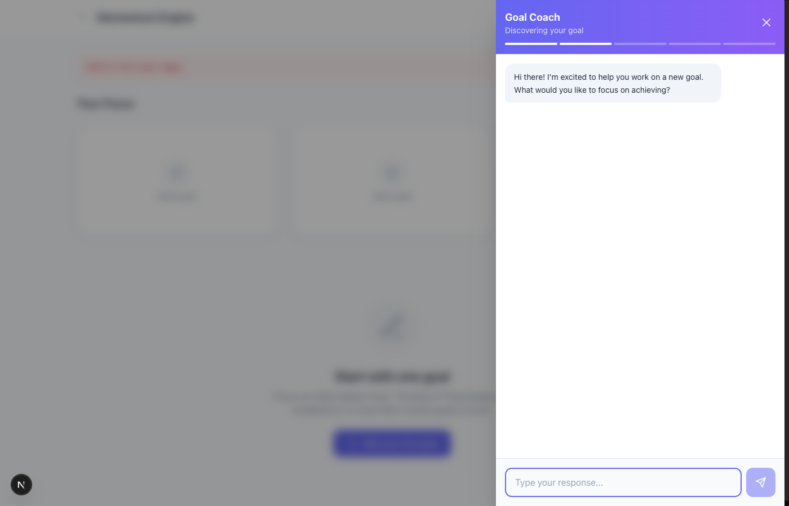
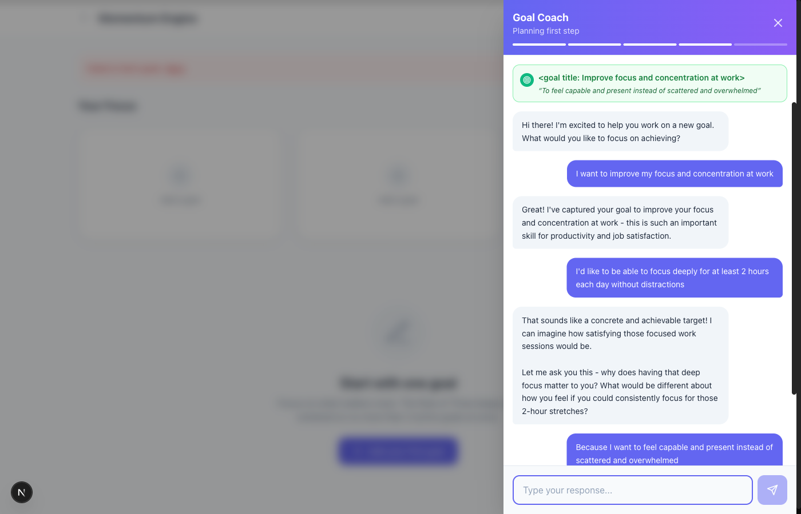

# Goal Coach UX Review Summary

**Test Date:** January 8, 2026
**Test Duration:** 44.6 seconds
**Result:** Conversation flow completed successfully

---

## Executive Summary

The Goal Coach feature provides a guided 6-stage conversational flow to help users define meaningful goals. The autonomous AI test successfully completed the entire flow, capturing 16 screenshots and 48 console log entries. The conversation UX is smooth and the AI coach provides helpful, empathetic responses.

### Key Findings

| Aspect | Status | Notes |
|--------|--------|-------|
| Conversation Flow | Working | All 6 stages completed successfully |
| UI Animations | Good | Smooth slide-in modal, responsive updates |
| AI Responses | High Quality | Empathetic, contextual, well-paced |
| Progress Indicator | Working | Stage indicator updates correctly |
| Goal Summary Card | Working | Updates progressively as data is captured |
| Error Handling | Issue | 401 errors when persisting to database |

---

## Screenshots Overview

### 1. Goals Page Initial State


**Observations:**
- Clean empty state with "Rule of Three" concept
- Three placeholder cards for active goals (0/3 active)
- Clear CTA: "Add your first goal" button
- Error banner visible ("Failed to fetch goals") - indicates auth issue with API

### 2. Goal Coach Modal - Welcome Stage


**Observations:**
- Modal slides in from right with backdrop blur
- Purple gradient header with "Goal Coach" title
- Stage indicator shows "Discovering your goal"
- 5-segment progress bar (2 segments filled)
- Friendly welcome message from coach
- Clean input field with send button

### 3. Goal Summary Card Appears


**Observations:**
- Green goal summary card appears at top of chat
- Shows captured goal title with target icon
- "Why" statement displayed in italics with quotes
- Progress bar shows advancement through stages
- Conversation history scrolls naturally

### 4. Goal Creation Complete


**Observations:**
- Full goal summary card with title, why, and first step
- "Creating your goal..." badge with checkmark
- Complete conversation history visible
- Clean celebration state

---

## Conversation Flow Analysis

### Stage Progression
```
welcome → goal_discovery → why_drilling → micro_win → confirmation → complete
```

### Timing Analysis
| Stage | Response Time |
|-------|---------------|
| Welcome → Goal Discovery | ~3s |
| Goal Discovery → Why Drilling | ~3s |
| Why Drilling → Micro Win | ~4s |
| Micro Win → Confirmation | ~3s |
| Confirmation → Complete | ~2.5s |

**Total conversation time:** ~45 seconds

### Coach Response Quality

| Message | Assessment |
|---------|------------|
| "Hi there! I'm excited to help you work on a new goal." | Warm, inviting |
| "Great! I've captured your goal..." | Confirms understanding |
| "Let me ask you this - why does having that deep focus matter to you?" | Probing deeper motivation |
| "I can see how important it is for you to shift from that overwhelming, scattered feeling..." | Empathetic reflection |
| "That's a perfect first step - starting small with focused time will help you build the concentration muscle you need!" | Encouraging, actionable |

---

## Console Log Analysis

**Total Logs:** 48
**Errors:** 3
**Warnings:** 0

### Error Details

| Error | Count | Cause |
|-------|-------|-------|
| `401 Unauthorized` on `/api/goals` | 3 | API requires authentication but SKIP_AUTH only bypasses layout check |

### State Transitions Logged

1. `startConversation called, isStarted: false`
2. `Stage transition: welcome -> goal_discovery`
3. `Goal data updated` (title captured)
4. `Stage transition: goal_discovery -> why_drilling`
5. `Stage transition: why_drilling -> micro_win`
6. `Goal data updated` (why captured)
7. `Stage transition: micro_win -> confirmation`
8. `Goal data updated` (micro-win captured)
9. `Stage transition: confirmation -> complete`
10. `Goal COMPLETE! Final data`

---

## UX Strengths

1. **Progressive Disclosure** - Goal summary card builds up as data is captured
2. **Visual Progress** - 5-segment progress bar shows clear advancement
3. **Empathetic AI** - Coach reflects user's emotional language back
4. **Smooth Animations** - Modal slide-in feels polished
5. **Clear Stage Labels** - Header shows current stage ("Discovering your goal", "Finding your why", etc.)
6. **Conversational Flow** - Natural back-and-forth dialogue

---

## UX Issues & Recommendations

### Issue 1: Error Banner Visibility
**Severity:** Medium
**Description:** "Failed to fetch goals" error shown on initial page load
**Impact:** May concern users even when coaching flow works
**Recommendation:** Hide error during SKIP_AUTH mode or improve error messaging

### Issue 2: API Auth in Test Mode
**Severity:** Medium
**Description:** `/api/goals` returns 401 even with SKIP_AUTH=true
**Impact:** Goals aren't persisted in test mode
**Recommendation:** Add SKIP_AUTH check to API routes

### Issue 3: Goal Title Formatting
**Severity:** Low
**Description:** Goal title shows as `<goal title: ...>` with angle brackets
**Impact:** Minor visual issue in summary card
**Recommendation:** Clean up marker text before display

### Issue 4: Completion Check Spam
**Severity:** Low
**Description:** Multiple `[GoalCoach] Completion check` logs in quick succession
**Impact:** Console noise during development
**Recommendation:** Debounce completion check or reduce logging

---

## Test Artifacts

All artifacts saved to: `tests/ux-review/session-2026-01-08T01-28-05/`

| File | Description |
|------|-------------|
| `ux-review-report.json` | Structured test results |
| `conversation-transcript.md` | Full conversation with markdown formatting |
| `console-logs.json` | Complete console log capture |
| `screenshots/*.png` | 16 screenshots at key moments |

---

## Recommendations for Next Steps

1. **Fix API Authentication** - Add SKIP_AUTH support to `/api/goals` route
2. **Clean Goal Title Display** - Remove marker text from rendered goal title
3. **Add Loading States** - Show skeleton UI while waiting for AI response
4. **Test Edge Cases** - User cancellation, back navigation, timeout handling
5. **Performance Metrics** - Track AI response times in production
6. **A/B Test Prompts** - Try different coach personalities

---

## Conclusion

The Goal Coach conversation flow provides an excellent user experience. The AI responses are empathetic and guide users through meaningful goal-setting. The progressive goal summary card is particularly effective at showing users their goal taking shape. Minor issues around authentication and text cleanup should be addressed before production release.
